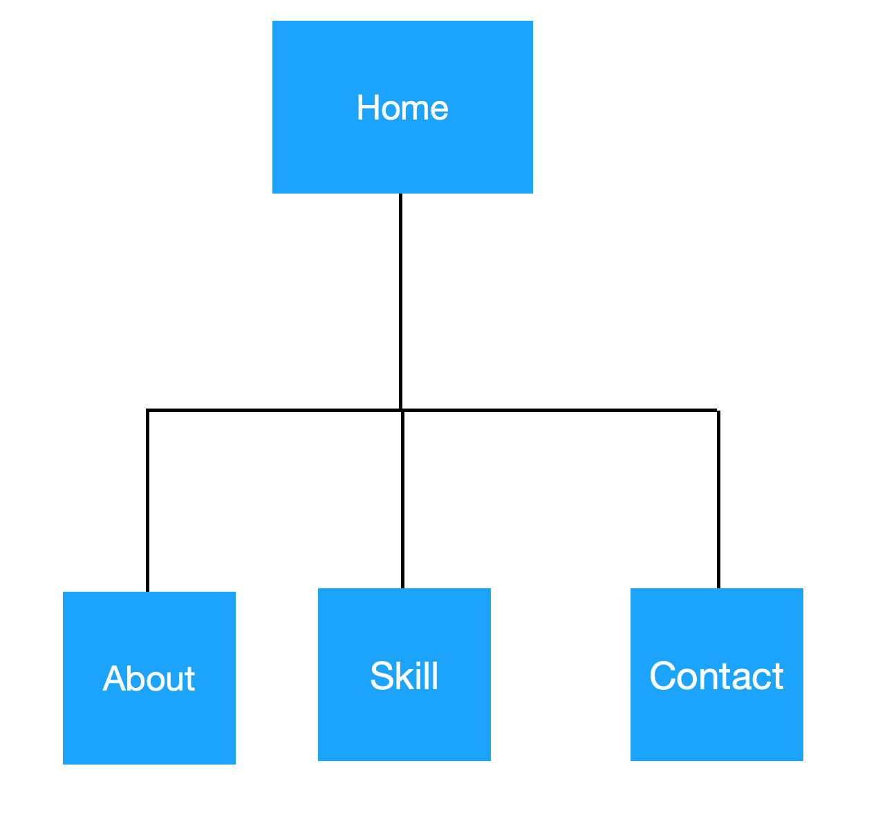
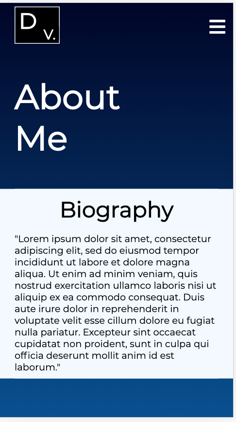
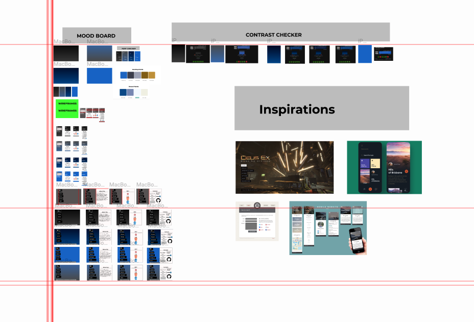
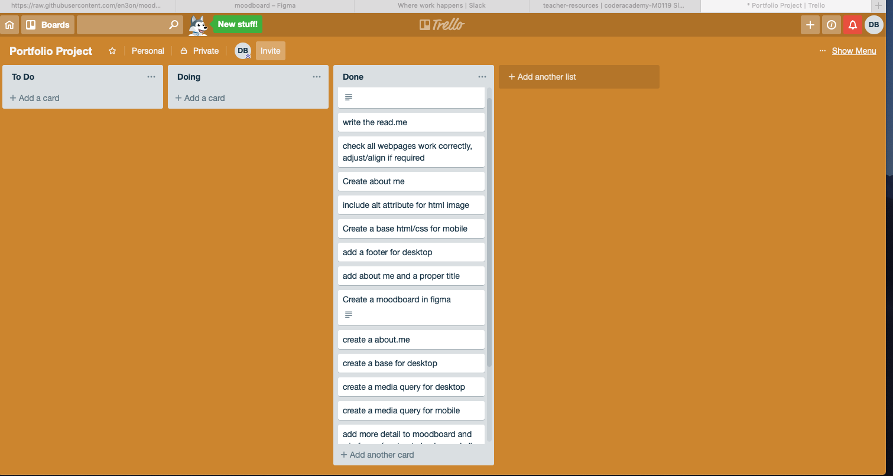
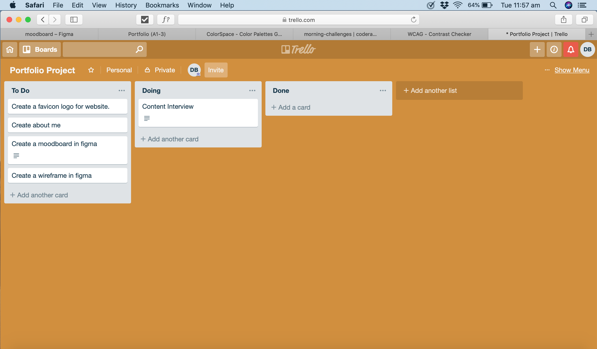

# Portfolio Website
### by David Bui

## GitHub Link
[GitHub Respository](https://github.com/dav2019/portfolio)
## Netlify Link
[Netifly](https://condescending-hypatia-6f94fa.netlify.com)

## Purpose
The purpose for this web portfolio is to test my self if i am capable of producing a good responsive mobile and desktop website. As well as showing it off my talents, abilities and coding experience to potential employers.

## Funtionality/Features
My Web Portfolio works for both platform mobile and desktop and even tablets. 
### Homepage
For deskop, upon opening the web portfolio, users will see the title "David Bui Web Portfolio" homepage and have the following options located on the left under the logo, which are clickable HOME, ABOUT, SKILL, CONTACT. Also there is a footer located at the bottom of the page that contains my name and my social contacts Linkedin and Github. These social contacts are clickable and if users click one of them it will send them to my linkedin or github page. Furthermore there is a beautifully made logo using html/css only located on the top left corner of the page. It also has a navbar located on the left, which changes the background to white and the font to black when users hovers the pointer over it.

For mobile, user are presented with the same title heading from the desktop. One good thing when user uses mobile, there is a very tasty hamburger menu located at the top right corner of the mobile page. When user touches the hamburger menu it will show the following links (HOME, ABOUT, SKILL, CONTACT) and if pressed on one of the links it will change the background of that link to a light greenish color and goes to that page.
### ABOUT ME PAGE
Both mobile and desktop has contents explaining who i am. The only difference is that mobile it has 1 heading (ABOUT ME) and 1 subheading (Biography), whereas desktop has one heading (About me with a line beneath) and a fixed navbar located on the left.
### SKILL PAGE
Both mobile and desktop has the icon image of ruby, html5 and css. This pages reveals the software programs that i have learnt so far.
### CONTACT PAGE
Both mobile and desktop has a subheading called Get In Touch, beneath that subheading there is a form for user to enter there details. They must enter all (first name, last name, email and message) for it to work. Otherwise if user doesn't and press/click sumbit it will tell the user "please fill in this field". The only difference between mobile or desktop page is my github and linkedin links are located below the submit for mobile and for desktop it is located at the right side below Contact heading. Note for mobile the links are the picture not the words and there is a good reason for that I want to make to easy for user to press, since mobile display are very small.

## Sitemap

### My Sitemap

## Screenshots
### homepage

### about me page

## Target Audience
target audience are potential employers

## Tech stack
HTML, CSS, FIGMA, Trello, Github, formspree.io, netlify

## Design Process

## Wireframes
[wireframes link](https://www.figma.com/file/T8vbMIlUDiXHaD9Aefo1d2Qm/wireframe)

### wireframe

## Project plan
### Project plan 
Screenshots of trello boards

## Short Answers
### Describe key events in the development of the internet from the 1980s to today (max 150 words).
Networks were widely deployed in the 1980s and its first main goal was to support scientific research. A year later the National Science Foundation was the major support of networking, they provided grant to establish Computer science network(CSNET), which provided networking services to university computer scientists. In 1986 National Science Foundation’s NSFNET goes online to connected supercomputer centres at 56,000 bits per second(typical speed of dial-up computer modem). In 1989 word.std.com is the first commercial provider of dial-up access to the internet. In 1990 Tim Berners-Lee develops HyperText Markup Language (HTML), HTML continues to be the most important programming language on how we navigate and view the internet today. In 1990 ARPANET(the precursor of todays internet) becomes officially decommissioned. 1991 CERN introduce the World Wide Web to the public. 1998 Google search engine is born, change the way user use the internet.
### Define and describes the relationship between fundamental aspects of the internet such as: domains, web servers, DNS, and web browsers.
Domain is a group of computer and devices on a network that can be accessed and administered as one with a set of common procedures and rules. Within the Internet, domains are just an address book entry for an ip address. Web server is a system that consists of a physical server and software. Hardware side, web server is a computer that contains the web server software and the website files(HTML, CSS, img, JS). For software, web server is a program that facilitate HTTP communications. It's an important system that delivers content or services to end users over the internet. DNS is a phonebook of the Internet, main purpose is to translate domain names to IP address, so browser can load internet resources. Web browser is a software program that allows user to find and display the web pages. Browsers are primary use for accessing and displaying internet website.
### Reflect on one aspect of the development of internet technologies and how it has contributed to the world today.
In 1958, The US wanted to have a technology superiority over the rest of the world. It main specialisation for advancement in technology is computer science, thus Advanced Research Projects Agency was created. APRA called several research institution to be together to build a network. APRA calls in Bolt, Beranek and Newman (BBN) to start developing technology to network computers. They build a network for four computers, one from University of California Los Angeles, Stanford Research Institute, University of Carolina Santa Barbara and University of Utah. The network then became known as ARPANET in 1969. In 1977 the network had an extra of 107 computers. ARPANET allows people in (Government, Corporation, Universities) to do things with computer that hasn’t been done like remote logins, files transfer, email but was restricted to the public. Without the invention of ARPANET, the internet would be completely different or might not even exist.

